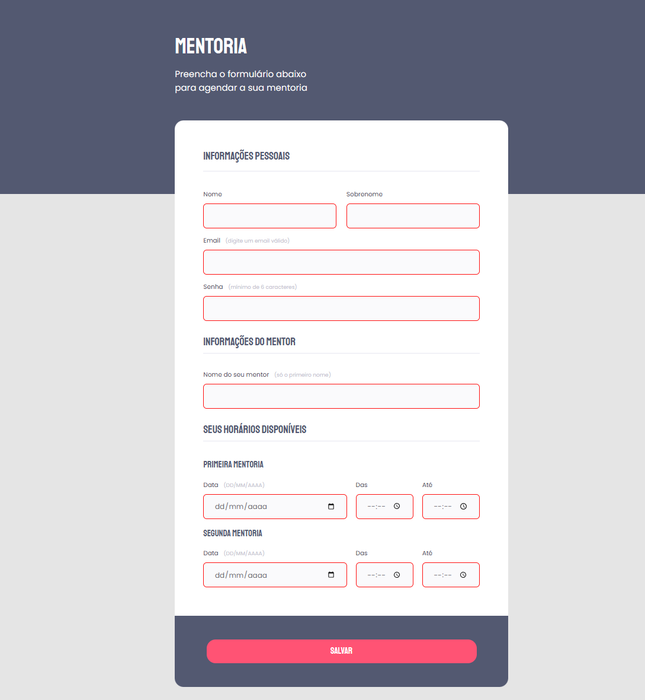
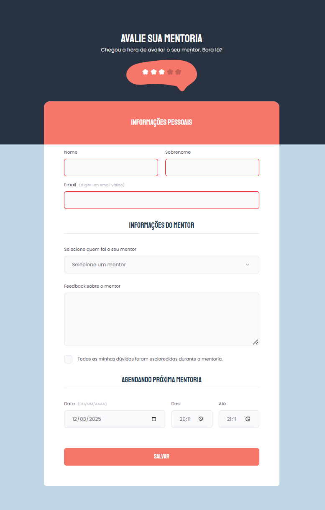

# Desafio: Criando formulários
Desafio do Explorer da Rocketseat.🚀

## Sobre o desafio
Para concluir este desafio deve-se recriar os formulários prototipados abaixo.

Links dos protótipos: 
    1. [Protótipo para o formulário de mentoria](https://www.figma.com/file/Nws1KWB7DyXBw8L6wXb9mp/Stage-03---Formul%C3%A1rio-intermedi%C3%A1rio/duplicate) 
    2. [Protótipo para o formulário de avaliação](https://www.figma.com/file/fnZyJHs7eqNFAA7tUrKcsD/Stage-03---Formul%C3%A1rio-avan%C3%A7ado/duplicate) 

## Resultados

### Formulário de mentoria:

### Formulário de avaliação da mentoria:
